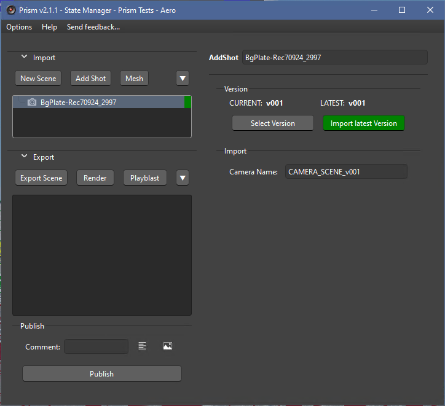
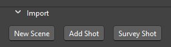
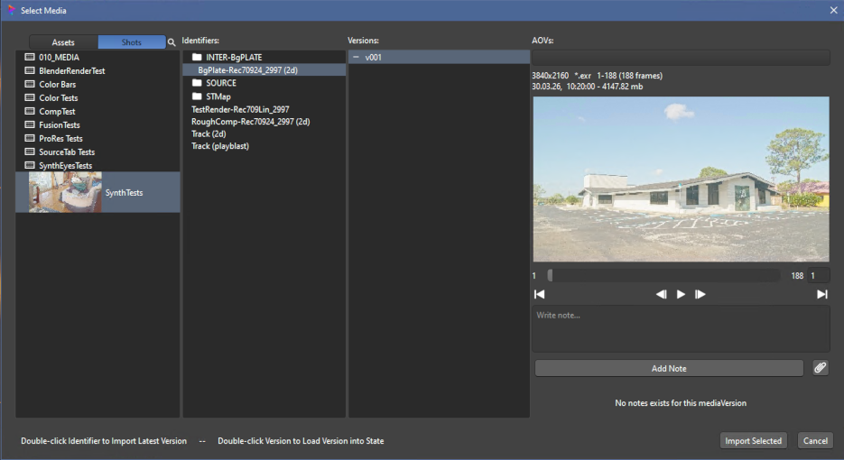
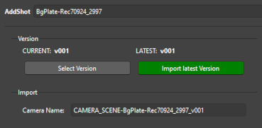
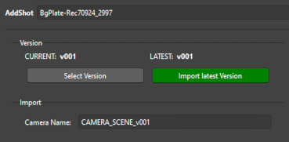

# **Adding Shots**

Adding Shots (Cameras) to SynthEyes is done through the AddShots import state.

 

## **Scene / Shot:**

There are two choices when importing media:

- **New Scene:** This is the same as the 'New' menu item in SynthEyes and will create a completely new Scene.  Be aware this will delete all existing Cameras in the Scene, and should be used to import the main "hero" shots.

- **Add Shot:**  This is the same as the SynthEyes 'Add Shot' menu item.  This will import and add an additional Shot/Camera to the existing scene.

## **Importing:**

Once the desired import button is clicked in the State Manager, a warning popup will display to confirm the desired action.  If accepted a custom Media Browser will be shown to allow the media selection.

There are several ways to select the media:

 - **Double-click Identifier:**  Will load and import the latest version of the media.  This will then open the SynthEyes 'Edit Shot' dialogue to allow configuring the media images.

 - **Double-click Version:**  Will load and import the selected version and open the 'Edit Shot' dialogue.

        NOTE: As of now, you cannot delete an added shot from SynthEyes.  The AddShot state will be deleted, but there will be no changes to the SynthEyes scene.

### **State Functions:**

 - **"Select Version"**:  This will open the MediaBrowser to allow the user to select a specific version of the Media Identifier.  This can be used for comparing versions, or manually upgrading/downgrading the version.

 - **"Import Latest Version"**:  This will load and import the highest version of the media (the same as double-clicking the Identifier as above).

        Both of these use the SynthEyes 'Change Shot Images' in the Shot menu.

 

 - **"Camera Name"**:  This allows for editing the Camera name in SynthEyes.  When initially created, the AddShot state will configure the name based on the type of import.  Any changes to the camera name in the State will be reflected in SynthEyes, as well as changes in SynthEyes will be reflected here (see **Camera Naming** below).

 

### **Camera Naming:**

When a Scene or Shot is imported, a camera is created in SynthEyes.  For better organization, the AddShot state will rename the camera.  The new camera name will have a prefix based on the type of import and then append the Media Identifier name and version.

- New Scene: 'CAMERA_SCENE'
- Add Shot: 'CAMERA_SHOT'

&nbsp;&nbsp;&nbsp;&nbsp;&nbsp;&nbsp;&nbsp;

When changing the version of the shot's images, if the version string exists in the camera name it will be updated.

  

___
jump to:

[**Interface**](Interface.md)

[**Importing 3D**](Importing_3d.md)

[**Scene Export**](Export_Scene.md)

[**Rendering**](Rendering.md)
