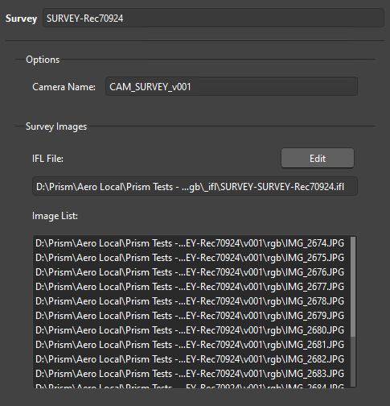
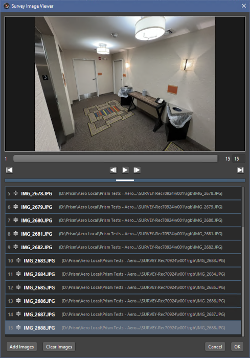
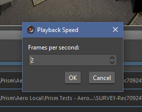
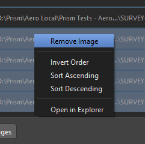
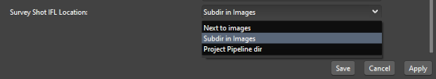

# **Adding Shots**

Adding Shots (Cameras) to SynthEyes is done through the AddShots import state.

 

## **New Scene / Add Shot / Survey Shot:**

There are three choices when importing media:

- **New Scene:** This is the same as the 'New' menu item in SynthEyes and will create a completely new Scene.  Be aware this will delete all existing Cameras in the Scene, and should be used to import the main "hero" shot.

- **Add Shot:**  This is the same as the SynthEyes 'Add Shot' menu item.  This will import and add an additional Shot/Camera to the existing scene.

- **Survey Shot:**  This is the same as the SynthEyes 'Add Survey Shot' menu item.  This will allow the selection and importing of Survey Images to create a Survey Camera to the existing scene (see **Survey Shot** below).

## **Importing:**

Once the desired import button is clicked in the State Manager, a warning popup will display to confirm the desired action.  If accepted a custom Media Browser will be shown to allow the media selection.

There are several ways to select the media:

 - **Double-click Identifier:**  Will load and import the latest version of the media.  This will then open the SynthEyes 'Edit Shot' dialogue to allow configuring the media images.

 - **Double-click Version:**  Will load and import the selected version and open the 'Edit Shot' dialogue.

> [!IMPORTANT]
> Although SynthEyes allows deletion of additional shots, you cannot delete the 'Scene' shot. If you right-click-delete the Scene Shot State, it will be removed from the State Manager, but will not be removed from the SynthEyes scene.

> [!CAUTION]  
> Deleting shots in SynthEyes can be a bit fragile.  Please make sure you save the scene before deleting a Shot State.

### **State Functions:**

 - **"Select Version"**:  This will open the MediaBrowser to allow the user to select a specific version of the Media Identifier.  This can be used for comparing versions, or manually upgrading/downgrading the version.

 - **"Import Latest Version"**:  This will load and import the highest version of the media (the same as double-clicking the Identifier as above).

> [!NOTE]  
> Dev Note: Both of these use the SynthEyes 'Change Shot Images' in the Shot menu.

 

 - **"Camera Name"**:  This allows for editing the Camera name in SynthEyes.  When initially created, the AddShot state will configure the name based on the type of import.  Any changes to the camera name in the State will be reflected in SynthEyes, as well as changes in SynthEyes will be reflected here (see **Camera Naming** below).

 

 ## **Survey Shot:**

Survey Shots are a special type of a Shot/Camera in SynthEyes, and are a collection of still images listed together in a '.ifl' file.  The Prism integration provides UI to select, view, arrange, and import the Survey images.

> [!NOTE]
> Please see the SynthEyes User Manual for more information and usage of Survey Shots.

  

 ### **Survey Image Viewer:**

After selecting the images for the Survey Shot in the Select Media popup window, the images will be displayed in the Survey Image Viewer.  This allows the user to preview the Survey images, and to arrange as desired.

> [!NOTE]
> Survey images can be any arbitrary set of images, but the Image Viewer will attempt to import an image sequence using standard sequence frame-number matching.  If more images that were not recognized need to be added, click the 'Add Images' button to open the File Explorer.

After a Survey Shot has been created, it can be edited by clicking the 'Edit' button in the AddShot State.  This will open the .ifl file in the Survey Image Viewer and allow further editing of the Survey Image list.

  

#### **Playback:**

The Survey Image Viewer has standard playback controls, and by default the playback rate is 2 fps.  This slow speed allows for better viewing of the Survey sequence. The playback speed can be changed by right-clicking the Play/Pause button.

  

#### **Image Ordering:**

The Survey Image Viewer displays the selected images in the image list.  The order of the images in the list will be the order they are used in the SynthEyes Survey Shot (see the SynthEyes User Manual for more information).

 When the images are initially imported into the Viewer, an attempt is made to recognize image sequences based on standard frame-numbering, and displayed in order. The image files in the list can be manually re-ordered by drag/dropping in the UI, or using the options in the right-click menu of the items.

  

#### **IFL Save Location:**

As described above, a SynthEyes Survey Shot uses a simple text file with an '.ifl' extension that holds the filepath for each image used for the Survey Shot.  By default, SynthEyes saves this file in the same directory as the source images.  The Prism integration allows for a user-configurable location (see [**Interface**](Interface.md)) for the .ifl to be saved.

- **Next to images:** This will save the .ifl file in the same directory as the source images (SynthEyes default).
- **Subdir in images:** This will create a new '_ifl' subdir for the file in the source images dir.
- **Project Pipeline dir:** This will create a 'SynthEyes/IFL' directory in the Project's pipeline folder for the .ifl file.  It will use the Prism Shot/Asset name as a subdir in the IFL dir for the 'ifl' file.

  

### **Camera Naming:**

When a Scene or Shot is imported, a camera is created in SynthEyes.  For better organization, the AddShot state will rename the camera.  The new camera name will have a prefix based on the type of import and then append the Media Identifier name and version.

> [!NOTE]
> The default prefix's can be configured in the Prism SynthEyes DCC settings (see [**Interface**](Interface.md)).

  
 
&nbsp;&nbsp;&nbsp;&nbsp;&nbsp;&nbsp;&nbsp;

When changing the version of the shot's images, if the version string exists in the camera name it will be updated.

  

___
jump to:

[**Interface**](Interface.md)

[**Importing 3D**](Importing_3d.md)

[**Scene Export**](Export_Scene.md)

[**Rendering**](Rendering.md)
