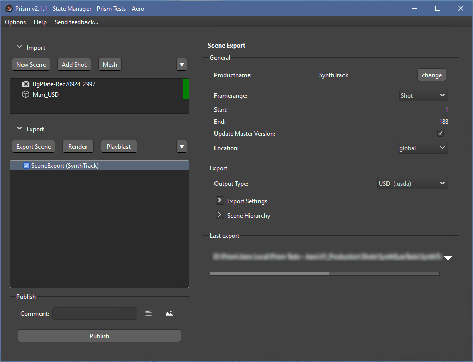
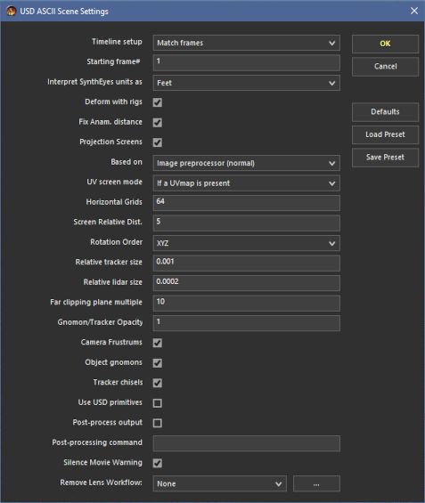
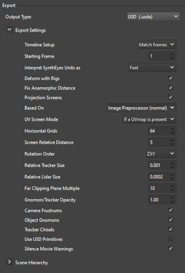
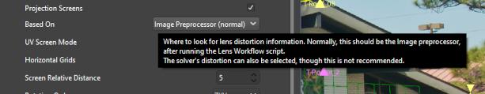
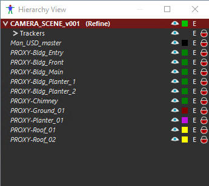
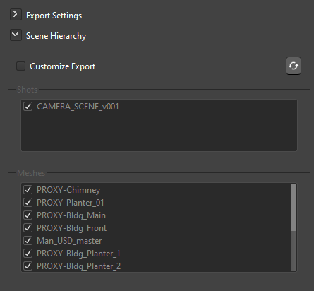
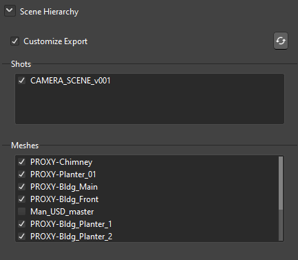

# **Scene Export**

SynthEyes has many formats to export a solved scene.  The Prism integration handles several of the most popular formats using the SceneExport state in the State Manager.  This allows several output formats to be exported at the same time.  Scene exports will be saved in the Prism project's Product tab.

Currently supported formats are .USD, .FBX, .ABC, Blender (.py), Maya (.ma), Blackmagic Fusion (.comp), and Nuke (.nk).

 

## **Export Settings**

SynthEyes has many configuration settings for the scene exports.  In the SynthEyes UI this is controlled by the Export Settings dialogue that is displayed during an export.  The Prism SceneExport state has these settings configurable in each state.

&nbsp;&nbsp;&nbsp;&nbsp;&nbsp;&nbsp;&nbsp;

Additionally, each setting has the same Tooltip text as in the SynthEyes UI to aid in those familiar.

 

 

## **Scene Hierarchy**

In SynthEyes the various objects can be marked as 'Exportable' or not.  This can be done in several places in SynthEyes and can be seen in the Hierarchy View:

 

The SceneExport state has this Hierarchy in a separate dropdown, and allows for customization of exported objects (for example disabling export of witness Shot/Cameras).

&nbsp;&nbsp;&nbsp;&nbsp;&nbsp;&nbsp;&nbsp;

- **Customize Export:** With this unchecked, the scene's objects will be exported as configured in the SynthEyes scene.  But if checked, the user may enable/disable the export of the various objects in the scene.

- **Refresh:** This will refresh the State's Hierarchy list from the current settings in the SynthEyes scene.

 

## **Dev Notes**

The Exporter settings in SynthEyes took a bit of work to get functioning in Python.  As far as I know, there are no API calls to configure these exporter settings.  In SynthEyes these setting are configured in the UI when an export is triggered.  And each format's export settings are saved in one of several settings .json files (for example 'user_presets.json') under a 'Most Recently Used' key.

The SceneExport state uses the SyPy '.export()' API call, which only has parameters for format and filepath.  This will use the export settings from the last export.  In order to allow user configuration of these settings, this integration uses a custom Sizzle script that will edit the SynthEyes Workflow Presets for the exporter type.

The basic flow is:
- User configures the settings in the SceneExport state UI and Publishes.
- The state will write a small psuedo-Sizzle file named 'PrismExportData.txt' that contains a list of all the settings and values.
- The state will call SynthEyes to run the custom Sizzle 'Prism_Exporter_Setup.szl' that will read this data file and set all the exporter settings in the Workflow Presets .json via Sizzle functions.
- The state will then trigger the export.

 

Example PrismExportData.txt:

        //  This file is part of the Prism Integration into SynthEyes.
        //
        //  This data file is written by the Prism Python script,
        //  and is Included in the Prism_Exporter_Setup.szl.  The Sizzle
        //  will use these values and set the Exporter settings.

        exporter_Settings = [
            ["workArea", "2"],
            ["userStart", 1],
            ["units", "ft"],
            ["buildRigs", 1],
            ["fixAD", 1],
            ["doScreen", 1],
            ["usePreprocessor", "1"],
            ["uvScreenMode", "1"],
            ["nomgrid", 64],
            ["relScreenDis", 5],
            ["rotOrder", "1"],
            ["relTrkSize", 0.001],
            ["relLidarSize", 0.0002],
            ["relFarClip", 10],
            ["miscOpacity", 1.0],
            ["doFrustrum", 1],
            ["doGnomon", 1],
            ["doChisel", 1],
            ["geoPrimitives", 0],
            ["silentMovies", 1]
        ]

        exporter_Type = "USD ASCII Scene"
        exporter_SettingsName = "USD ASCII Scene Settings"

 

Prism_Exporter_Setup.szl:

        //SIZZLET Prism Exporter Setup

        //  This is part of the Prism Integration into SynthEyes
        //
        //  This Sizzle will read the data file that is written by the Prism
        //  Python script, and set the various settings in SynthEyes.

        // Get Data File (Written by the Prism Plugin)
        INCLUDE("./PrismExportData.txt")

        // Assign the Current and User Workflow Presets Objects
        currWf = WFPreset.current
        userWf = WFPreset.user

        // Initialize Roots List
        roots = []
        i = 1

        // Add Scene Root
        roots[i] = currWf
        i = i + 1

        // Find and add MRU Root
        for (rootChild in userWf.child)
            if (rootChild.nm == "Most Recently Used")
                roots[i] = rootChild
                i = i + 1
            end
        end

        // Process all Roots
        for (root in roots)
            // Find Exporter Type in Settings
            exporters = root.FindNamedOrCreate("Exporters", "Exporters")
            exportSettings = exporters.FindNamedOrCreate(exporter_Type, exporter_Type)

            // Iterate the Settings and Set Each One
            for (settings in exportSettings.child)
                if (settings.nm == exporter_SettingsName)
                    for (pair in exporter_Settings)
                        settings.SetValue(pair[1], pair[2])
                    end
                end
            end
        end

 

___
jump to:

[**Interface**](Interface.md)

[**Adding Shots**](AddShots.md)

[**Importing 3D**](Importing_3d.md)

[**Rendering**](Rendering.md)

