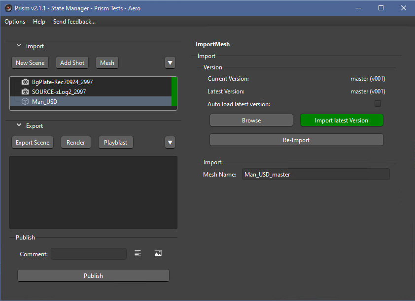
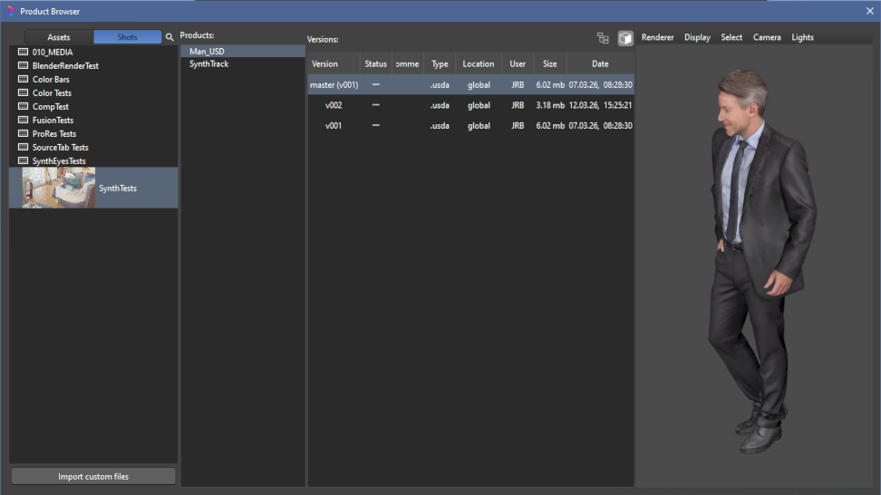

# **Importing Mesh Objects**
The SynthEyes integration adds the ability to import various type of 3D objects into the Scene.  Importing 3D is done using Prism's State Manager with the ImportMesh state.  This uses the SynthEyes Import -> Mesh command and allows .USD, .OBJ, .FBX, .ABC, .C4D, .DAE, .DXF amongst others.

 

## **Importing:**

Upon clicking the 'Mesh' button, the Product Browser will launch to allow choosing the import.'

There are several ways to select the import:

 - **Double-click Identifier:**  Will load and import the latest version of the Product.

 - **Double-click Version:**  Will load and import the selected version.

### **State Functions:**

 - **"Select Version"**:  This will open the Product Browser to allow the user to select a specific version of the Product.  This can be used for comparing versions, or manually upgrading/downgrading the version.

 - **"Import Latest Version"**:  This will load and import the highest version of the Product (the same as double-clicking the Identifier as above).

 - **"Auto-load Latest Version"**:  This will automatically load the latest version of the Product whenever the SynthEyes scene is opened.

 - **"Re-import"**:  This will reload the 3d mesh from disk.

        NOTE:  when changing the version or reloading a mesh, the transforms are kept.  But due to limnitations in SynthEyes, some 3d formats do not seem to keep any scaling done in SynthEyes.

 

### **Mesh Naming:**

When a 3d Mesh is imported, the ImportMesh state will rename the mesh in SynthEyes.  The new mesh name will use the object name and append the version. Any changes to the Mesh name in the State will be reflected in SynthEyes, as well as changes in SynthEyes will be reflected here.

When changing the version of the mesh, if the version string exists in the mesh name it will be updated.

  

___
jump to:

[**Interface**](Interface.md)

[**Adding Shots**](AddShots.md)

[**Scene Export**](Export_Scene.md)

[**Rendering**](Rendering.md)
