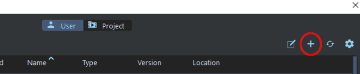
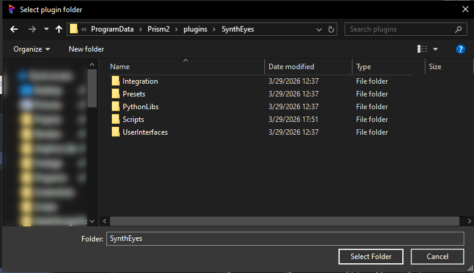
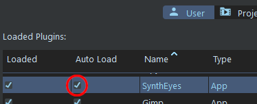
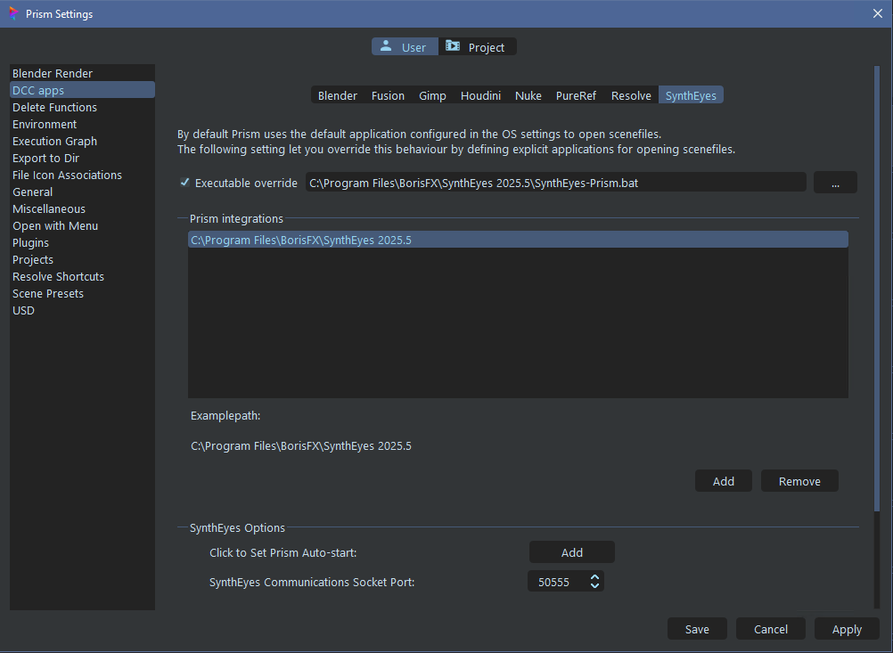

# **Installation**

 

Copy the directory named "SynthEyes" to a directory of your choice, or a Prism2 plugin directory.

It is suggested to have the SynthEyes plugin with the other DCC plugins in: *{drive}\ProgramData\Prism2\plugins*

Prism's default plugin directories are: *{installation path}\Plugins\Apps* and *{installation Path}\Plugins\Custom*.

You can add the additional plugin search paths in Prism2 settings.  Go to Settings->Plugins and click the gear icon.  This opens a dialogue and you may add additional search paths at the bottom.

Once added, select the "Add existing plugin" (plus icon) and navigate to where you saved the Fusion folder.

 

 

Afterwards, you can select the Plugin autoload as desired:

 

To add the integration, go to the "DCC Apps" -> "SynthEyes" tab.  Then click the "add" button and navigate to the folder containing SynthEyes's executable (SynthEyes64.exe).

 

## **Python / SyPy**

In order to use the plugin it is required to have Python 3.11+ installed on the computer https://www.python.org/downloads/release/python-3139/.  The Python executable must be available to SynthEyes.

There are two ways to configure Python in SynthEyes:

1. In SynthEyes navigate to [Edit -> Edit Preferences -> System] and add the Python .exe to the 'Python Executable' field.

2. Set the environment variable 'SYNTHEYES_PYTHON_PATH' with the full filepath of the Python executable.

        Note: Using 'python.exe' will launch a terminal window when Prism launches in SynthEyes.  Use 'pythonw.exe' to suppress the popup window.

SyPy is the SynthEyes API library and is included with SynthEyes versions that allow scripting.  There is no need to do anything with SyPy as the integration imports from the default directory.

See the SyPy Manual for more information.

 

___
jump to:

[**Interface**](Interface.md)

[**Adding Shots**](AddShots.md)

[**Importing 3D**](Importing_3d.md)

[**Scene Export**](Export_Scene.md)

[**Rendering**](Rendering.md)
