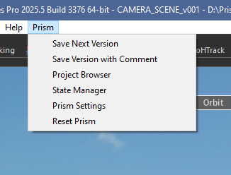
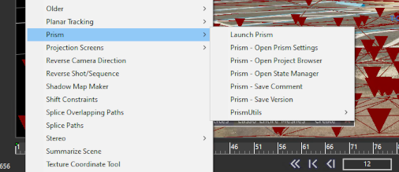
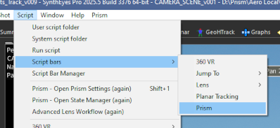
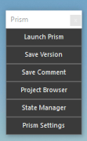
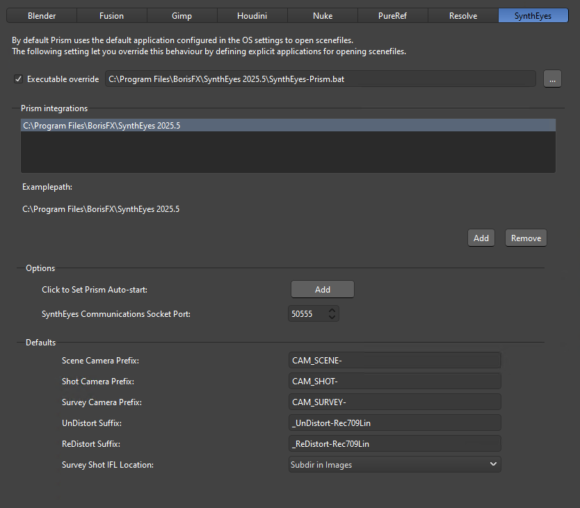

# **Interface**

## **Prism Menu:**

 

Prism functions are accessed through the Prism menu in the top bar of SynthEyes's UI.  The menu will look familiar to Prism users and contains the normal Prism functions.

### **Menu Options:**
>[!IMPORTANT]  
> The plugin attempts to refresh the SynthEyes window UI after adding the Prism menu. If the user is interacting with the window during start, the menu may not appear until you hover over the menu bar.

- **Save Next Version:** Captures a thumbnail from the SynthEyes window and saves it to a new incremented version in Prism's project structure.

- **Save Version with Comment:**  Opens a dialogue to allow the user to enter a comment and/or description of the new version.  It also allows the user to select a screenshot to be used for the thumbnail.  It then saves to a new version as above.

- **Project Browser:**  Launches the Prism Project Browser.

- **State Manager:**  Launches the Prism State Manager.  This allows the user to load shots (see [**Adding Shots**](AddShots.md)), import 3d objects (see [**Import 3D**](Importing_3d.md)), export the scene to various formats (see [**Scene Export**](Export_Scene.md)), and various renders (see [**Rendering**](Rendering.md)) to/from the Prism project structure.

- **Prism Settings:**  Launches the Prism Settings window.

- **Reset Prism:**  will restart/reload the Prism Functions inside of SynthEyes, and can be used if there are any glitches with Prism while SynthEyes is open.

 

### **SynthEyes Script Menu / Toolbar:**

The Prism menu on the main SynthEyes menu bar is the easiest way to work with Prism in SynthEyes.  But technically all the Prism menu items are just SyPy scripts, and thus appear in the SynthEyes Script menu.  Launching these scripts has the same result as selecting a menu item from the Prism Menu.

> [!CAUTION]  
> NOTE: the script file under the Scripts->Prism->PrismUtils is not meant to be used by the user.  This exists to allow the Prism integration to set certain settings in SynthEyes during a publish.

 

SynthEyes also has 'Script Bars' which are just small UI windows that can contain scripts.  The Prism integration has a toolbar named Prism that has the same items as the Prism menu.  This is not required for Prism to run, just an added convenience for the user if desired.

&nbsp;&nbsp;&nbsp;&nbsp;&nbsp;&nbsp;&nbsp;

 

## **Settings:**

The SynthEyes plugin has several functions that are user configurable from the Prism User-->DCC-->Fusion settings tab.

 

- **Prism Auto-start:** Adds a small .bat file to the 'Executable override' box above, and have Prism automatically start when opening a .sni file in the Prism Project Browser (see **Dev Notes** below for more information).

- **SynthEyes Communications Socket Port:**  The localhost port used for SynthEyes-Prism menu communications.  There is usually not a need to change this unless there is another process that is using the port and causing conflicts. (see **Dev Notes** below for more information).

 

## **Dev Notes**

### SynthEyes Scripting: 

SynthEyes does not have a Python environment that runs inside the SynthEyes instance.  Instead it uses a Python API called SyPY (SyPy3 for Python 3.x).  SynthEyes internally uses its own custom scripting language called 'Sizzle' to control the various functions, and SyPy uses socket communications to send the Python API 'commands' to the SynthEyes Sizzle listener.  Thus custom Python scripts import and use the SyPy API to control SynthEyes. See the SynthEyes Sizzle and SyPy manuals for more information.

### Script structure: 

When the Prism instance launches from SynthEyes (Prism_Start.py), it creates a new QApplication instance that creates a new instance of Prism core.  This QApp also creates a Qt window object that holds the core instance until SynthEyes is closed.  This window is hidden as the Prism functions are called from the Prism menu.

In order for the Prism menu inside SynthEyes to call Prism functions, the Prism core instance launches a socket listener in a separate process that monitors the specified port for these commands, and the menu items are just simple Python scripts that will send one socket 'command'.  All communications are kept in the local machine (127.0.0.1).

### Prism Auto-start:

SynthEyes does not automatically run scripts at startup, and so Prism will not load by default.  But SynthEyes allows the passing of a script filepath as an argument the syntheyes.exe to have SynthEyes run it.  The SynthEyes integration has a simple .bat file that will launch SynthEyes with this Prism launch script.  Thus clicking the 'Click to Set...'' button will add this .bat to the 'Executable override' box above, and have Prism automatically start Prism when opening a .sni file in the Prism Project Browser.

### Prism States Saving:

Each Prism DCC integration needs a way to save the StateManager State data into the scenefile.  The SynthEyes integration uses the SynthEyes Notes system.  Normally the Notes are used for comments and reminders in the UI similar to mark-up comments.  Prism uses this to store all the States and are hidden in the UI.

It does this by first creating an index Note (with number 1000) which contains the numbers of each created State Note.  Then each State in the StateManager will have a separate Note created (with sequential numbers) that has the State data.  For performance and SynthEyes Note-size limitations, the data is compressed and encoded using zlib and base64 and saved to the Note.

Index Note:

        Note 1000:
        {"notes": [1001, 1002, 1003, 1004, 1005, 1006, 1007]}

Example State Note:

        Note 1002:
        eJyrViouSSxJzUvMTVWyUiooTcrJLM5Q0lFKzs/NTc0rAYoBOSmpxclFmQUlmfl5IIFaAPJHEec=

 

___
jump to:

[**Adding Shots**](AddShots.md)

[**Importing 3D**](Importing_3d.md)

[**Scene Export**](Export_Scene.md)

[**Rendering**](Rendering.md)
