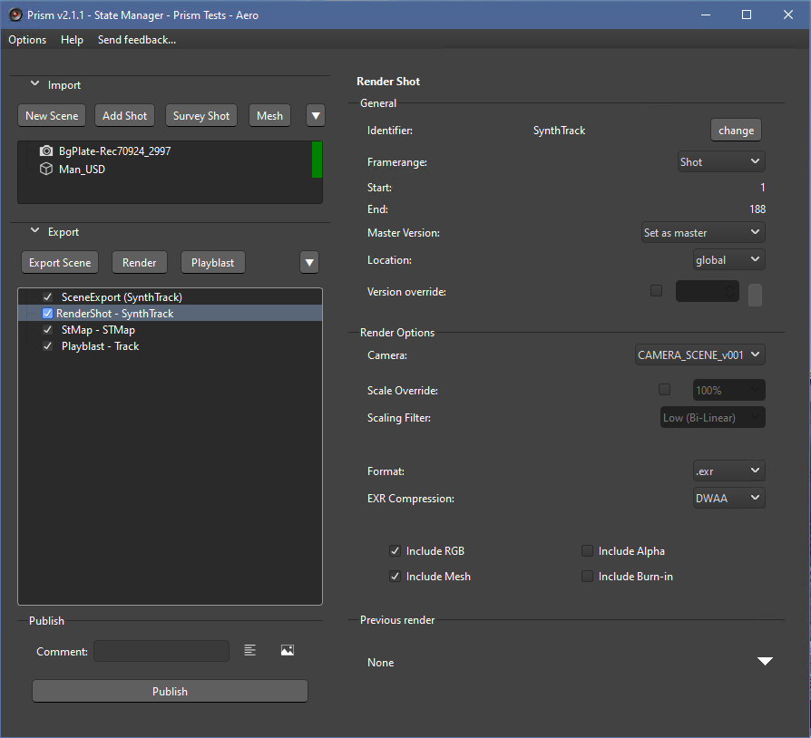
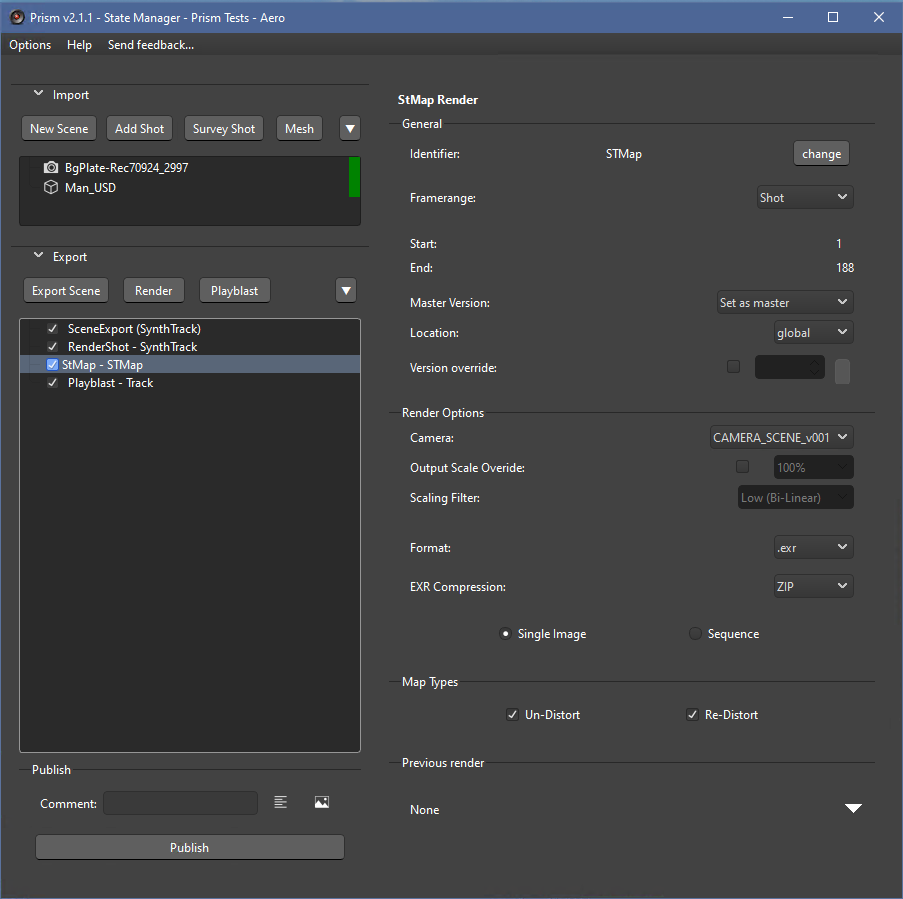
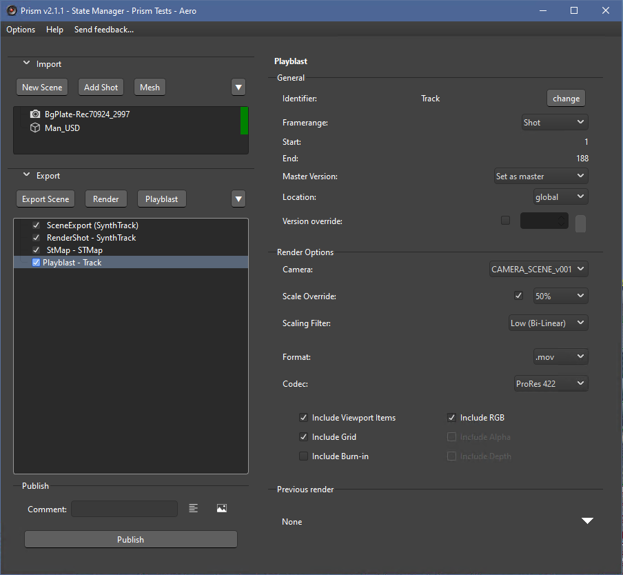

# **Rendering**

The SynthEyes Prism integration has three rendering states: RenderShot, STMap, and Playblast.  Each state has its purpose, and uses specific SynthEyes functions.

 

###  Common Render Options

- **Camera:**  Selects the Camera/Shot to Render.  For multiple cameras in a scene, use a separate state for each.

- **Scaling:** If the override is disabled, the rendered image size will be the same as the SynthEyes scene.  A sanity check popup will display to warn a user of scaling done in SynthEyes.  The 'Scaling Filter' selection controls the interpolation method for down-sampling. (See **Dev Notes** below for more info).

- **Format:**  The desired image output format. At present, the only formats that allow an alpha channel are .EXR, .PNG, and ProRes4444 or 4444XQ.

 

## **RenderShot**

The RenderShot state uses the equivalent of the SynthEyes 'Save Sequence' function to output a video file or image sequence from a Shot's Camera.  This can be used to render an Undistorted version of the media.

> [!NOTE]  
> This will render the images using the current 'Lens Workflow' settings.  A sanity check will warn the user if there has been distortion calculated, but no Lens Workflow chosen.

### **Options**
- **Include RGB:**  Renders the visible color images (RGB).  Normally enabled for almost all renders, though may be disabled for an Alpha-only render.
- **Include Alpha:**  Includes an Alpha channel in the render.  Only available in supported output formats.
- **Include Mesh:**  Includes the scene's 3D meshes in the render.
- **Include Burn-in:**  Includes burn-in data in the render. (NOTE: not functioning as expected - see **Dev Notes** below).

 

## **STMap**

The STMap state renders SynthEyes distortion maps (STMaps). This is similar to the 'Write Distortion Maps' menu item, but uses the Sizzle API calls (see Dev Note below).

> [!CAUTION]
> Rendering a STMap image sequence is slow and may take quite some time.  This comes from using the single-image render in a loop for every frame in the frame range (see Dev Note below).

### **Options**
- **Single / Sequence:**  Selects either single-image Distortion maps, or an image sequence. 
- **Map Types:**  Select which type of STMaps to render.  Each type will be rendered into a separate Media Identifier in Prism.  Each Identifier name will have '_UnDistort-Rec709Lin' or '_ReDistort-Rec709Lin' appended as a suffix.

> [!NOTE]  
> Dev Note:  This uses the SynthEyes Sizzle functions 'WriteRedistortImage' and 'WriteUndistortImage'.  This allows a user to select which STMaps are desired.  For image sequences the SynthEyes docs describe the existence of 'WriteRedistortSequence' and 'WriteUndistortSequence', but I am unable to get either to work without errors.  So unfortunately for sequences there is just a loop to render every frame separately, which is slow.  Thus unless a sequence is needed for changing distortion (such as a zoom or a breathing focus-pull), it is recommended to render a single image.

 

## **Playblast**

This state uses the SynthEyes 'Preview Movie' from the Perspective View.  It can be used to preview the tracked scene.

> [!TIP]  
> The Playblast will render whatever view is currently in the Perspective View.  That means if the view is currently not locked to the camera (for example orbited to a top-ish view), it will render from that viewpoint.

### **Options**
- **Include Viewport Items:** This will include all the visible items currently seen in the Perspective view WYSIWYG (trackers, meshes, moving objects, etc).
- **Include Grid:** Includes the current grid display.
- **Include Burn-in:**  Includes burn-in data in the render. (NOTE: not functioning as expected - see **Dev Notes** below).
- **Include RGB:**  Renders the visible color images (RGB).  Normally enabled for almost all renders, though may be disabled for an Alpha-only render.
- **Include Alpha:**  Includes an Alpha channel in the render.  Only available in supported output formats.
- **Include Depth:**  Includes a single Z-pass depth channel in the render. Only available in EXR output.

 

## **Dev Notes**

#### Scaling:

The render states have the option to down-scale the image for the render which can be useful for large-format media.  This is accomplished by configuring the Image PreProcessor 'DownRez' in its 'Rez' tab using Sizzle API calls.  This is the same for the 'Scaling Filter'.  During a Publish, the state will capture the current settings, set the override, and then reset the original settings.  The downside is that each time the images are scaled in SynthEyes, the SynthEyes pre-cache system will start to rebuild.  Unfortunately this has the affect of longer render times as the system is rebuilding thr cache the same time it is rendering.  During testing an attempt was made to increase the performance by temporarily disabling the pre-cache during a publish, but this did not help as SynthEyes then has to load each frame while it is rendering.  Thus this is just the way it has to be.

#### Render Settings Configuration:

SynthEyes render settings uses internal names for various things such as the image file compression scheme and visibility options.  A collection of some of these mappings is contained in this plugin's 'Synth_Formats.py' file for use throughout the code.  

#### Burn-in:

As of now, I am unable to get the Burn-in configuration working.  There is not much documentaiotn on what this setting string should be, and after testing could never get it to work.  Thus 

#### Quality:

 

___
jump to:

[**Interface**](Interface.md)

[**Adding Shots**](AddShots.md)

[**Importing 3D**](Importing_3d.md)

[**Scene Export**](Export_Scene.md)
